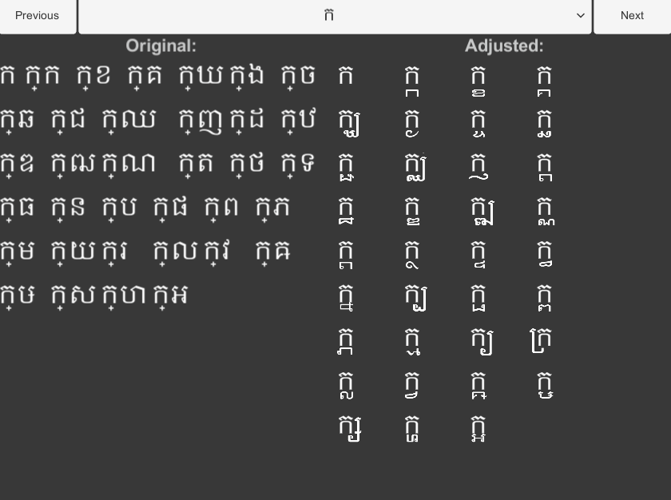
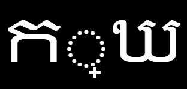

# Khmer Font Adjuster for Text Mesh Pro
Attempt at getting Khmer working in-game using Unity's Text Mesh Pro.

## Consonent joining fix:

Khmer has a rule that you can join 2 consonants together using a special  character to indicate the next consonent will go underneath the first. 
The second consonant will change to it's subscript form and join the first.

**What is typed without spaces (ថ ្ ម)**

**Result (ថ្ម)**

## HOW:
This was achieved by creating a sprite atlas of all the subscript forms of each consonant and creatign a sprite asset in Text Mesh Pro. Then in a script modifying the script to point tot he sprite asset as a fallback.

## NOTE:

This project was able to fix this issue but at the cost of being very restrictive for the time being.
- Must be used with Text Mesh Pro
- The subform characters can not be changed untill the consonent sprite asset is rebuilt with a new sprite atlas.
- Not all joined consonents work correctly.

There are still issues with this. So it is not the final version but can make the text more readable for Khmer readers!
